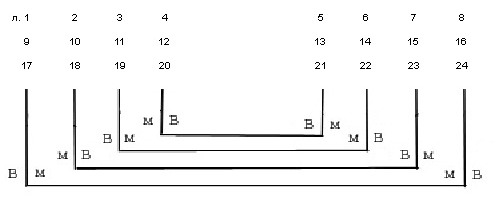
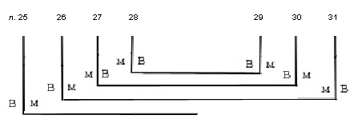
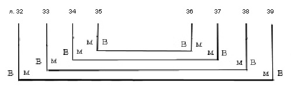
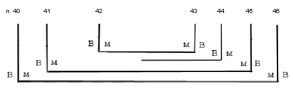
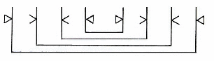

# Служебник № 518. XIII век.

Древнерусский извод.

4° (185 / 175 x 130 мм). 46 л.

Без конца, утраты листов между л. 31 и 32, л. 41 и 42.

Пергамен. Л. 42 палимпсест (на л. 42 первоначальный текст затерт и на его месте написан текст той части службы, которая должна была читаться на изъятом, вероятно, намеренно, листе). .

Устав одной руки. На л. 42 и 46 об. дополнения текста полууставом XV в.

Нумерация тетрадей не видна. Позднейшая нумерация листов арабскими цифрами чернилами в верхнем правом углу листов. Библиотечная нумерация карандашом на нижнем поле.

6 тетрадей: тетрадь 1 – 8 л. (л. 1 – 8), тетрадь 2 – 8 л. (л. 9 – 16), тетрадь 3 – 8 л. (л. 17 – 24), тетрадь 4 – 7 л. (л. 25 – 31; л. 25 вшивной), тетрадь 5 – 8 л. (л. 32 – 39), тетрадь 6 – 7 л. (л. 40 – 46, л. 44 вшивной).

Способ складывания пергаменных листов в тетрадях варьируется.

Тетради 1, 2, 3:

Тетрадь 4:

Тетрадь 5:

Тетрадь 6:

 Система разлиновки: Тип разлиновки – Leroy 00А1. 16 строк.

Поле текста: 142 /144 x 94 / 96 мм. Высота строки: 4 мм.

На л. 1 контурная заставка-плетенка киноварью, фон заполнен киноварью и чернилами с чередованием цветов в шахматном порядке.

Более 50-ти крупных киноварных инициалов старовизантийского стиля с различными вариациями контурной плетенки, иногда контур выполнен чернилами и заполнен киноварью. На л. 27 об., 35 об. и 45 об. тератологические инициалы. Крупные заголовки контурные чернилами с заполнением контура киноварью (л. 1, 5, 7 об., 16, 40 об.). Другие заголовки чернилами с начальными киноварными буквами при каждом слове. Небольшие киноварные буквы в тексте, многие из них контурные.

На л. 17, 18, 23, 36 оформление вынесенного на нижнее поле текста виньетами, выполненными пером чернилами и киноварью.

Переплет исконный – доски в коже. Размер: 185 / 190 x 133 / 135 x 45 мм; толщина крышек: 15 мм. Крышки без кантов. Корешок гладкий. Губочка на карешке. Капталы, плетеные из суровой нити. Крепление переплета на двух ремнях, которые закреплены гвоздями в углублениях на внутренних сторонах крышек, затем выведены на внешнюю сторону под покрытие и закреплены деревянными клиньями с внутренней стороны крышек. Дополнительное крепление блока книги к переплету шитьем каптала (не сохранилось). Завороты кожи покрытия закреплены на внутренних сторонах крышек гвоздями. На внутренней стороне нижней крышки по периметру краев заворотов покрытия сделано углубление, функция которого не ясна. Переплет имел одну ременную застежку на спень в торце верхней крышки (не сохранилась, остались только дыры). Судя по оставшимся дырам, на крышках переплета были защитно-декоративные металлические детали: средники и жуки по углам. Сохранилось четыре гвоздя от средника на нижней крышке.

Записи, наклейки, печати:

На внутренней стороне верхней крышки переплета скорописью XVIII в. – «На одной просфире» (зачеркнуто).

На корешке бумажная наклейка с надписью полууставом: «Служебник древлеписменный на пергамине...» (далее не читается из-за повреждения наклейки).

На л. 1, 10, 20 скорописным почерком XIX в. – «Библиотеки Новгородскаго Софийскаго Собора. 1855 год».

На л. 1, 46 печать-оттиск синего цвета овальной формы с надписью: «Из библиотеки СП\[етер\]бургской Духовной Академии».

На л. 46 библиотекарская заверочная запись (без даты, сделана библиотекарем М.Я.Майхровской, работавшей в ПБ в период 1907 – 1931 гг.).

На внутренней стороне верхней крышки переплета бумажная наклейка с надписью: «№ 518. Соф.».

Состояние рукописи удовлетворительное.

На л. 38 следы шва, проложенного на месте дыры в пергамене.

## Содержание

[Вечерня](518_1.md) — л. 1 – л. 5.

В рукописи имеет название мⷧо вⷱернѧꙗ. Вечерня состоит из четырех антифонов. Первому антифону соответствует священническая молитва «Господи, щедрый и милостивый...», второму – «Господи, да не яростию Твоею...», третьему – «Господи, Боже наш, помяни нас грешных...», четвертому – связанная с Пс 140 молитва «Вечер и утро и полудне...». Древнейшей греческой рукописью с такой же схемой молитв является евхологий X в. *Vat. gr. 1833* (Арранц М. 1979. с. 52).

[Панихида](518_2.md) — л. 5 – л. 7 об.

В рукописи имеет название мⷧо на панахидь. Представленное в рукописи последование является службой «паннухис» суточного круга древнего константинопольского кафедрального богослужения – песненного последования. Эта служба сохранилась во многих древнейших византийских евхологиях, начиная с рукописи VIII в. *Barberini gr. 336*. В данном служебнике служба представлена достаточно полно, из пяти молитв паннухис отсутствует лишь одна (четвертая).

[Утреня](518_3.md) — л. 7 об. – л. 12.

В рукописи имеет название мⷧо · ꙁаоутрьнѧꙗ. Из обычных 13-ти молитв византийской Утрени содержит 8 (отсутствуют 4‑я, 6‑я, 7‑я, 9‑я и 10‑я). Порядок молитв обычный. Молитва 12‑я озаглавлена мⷧо · егда · поⷮю · слⷡа (т.е. «Слава в вышних Богу...»).

[Молитвы священника перед совершением литургии](518_7.md) — л. 12 – л. 16.

Три молитвы имеют в рукописи название мⷧо пⷫо ꙁⷭа прѣдъ служⷠь. Первая «*Владыко Господи Боже наш, ныне хотящу приступити к страшней и чудней тайне...*» начинается сразу после этого общего заглавия. Вторая «*Владыко Господи Вседержителю, не хотяй смерти грешником...*» и третья «*Господи, несмь достоин, да под кров мои внидеши и в дом души моея...*» пронумерованы соответственно как мⷧо · ҃в · и мⷧо · ҃г ·

[Литургия Иоанна Златоуста](518_5.md) — л. 16 – л. 40 об.

В рукописи озаглавлена чⷩи лиⷮргиꙗ, далее следуют проскомидия и само последование литургии. После преломления Хлеба и )соединения Даров предписывается добавлять воду (возможно, имеется в виду Теплота) и произносить «*Се сниде Господь, яко дождь на руно и яко капля на землю каплющия*». Последование заканчивается молитвой на снятие риз, какая читается в Синайских глаголических листках (Афанасьева 2005)

[Литургия Преждеосвященных Даров](518_6.md) (без окончания, обрывается на заамвонной молитве) — л. 40 об. – л. 46 об.

В рукописи имеет название слⷤуба · ст҃го поста .

Такое заглавие литургия имеет во всех древнейших славянских списках, 16-ти рукописей древнерусской редакции (Слуцкий 1996, с. 121, Афанасьева 2004, с. 27). Начинается служба указанием въ поⷣне · а҃· неⷣ ·поⷭ · по стⷯир · вынидететь (так!) · поⷫ · і дьⷦꙗ · съ кадьлнⷱию, т. е. днем начала служения литургии преждеосвященных Даров назван понедельник первой недели поста. Во всех остальных списках древнерусской редакции, а также в некоторых славянских списках литургии в качестве первого дня служения литургии преждеосвященных указана среда сыропустной недели, что соответствует древней константинопольской традиции, зафиксированной как в уставе Великой церкви, так и в уставах студийского типа. В понедельник первой недели поста по этим уставам также положена литургия преждеосвященных Даров. Как и в большинстве списков древнерусской редакции (12-ти из 16-ти) в рукописи отсутствует ектения и молитва о готовящихся к просвещению.

[**Литература**](../literature.md)

Стасов 1884, табл. LI

Волков 1897, № 432. с. 77, 207

Муретов 1895a, с. 42, 219, 223, 236, 239, 240, 244, 248, 257, 261

Муретов 1895b, с. 54–64, 86–87, 93–94

Муретов 1897, с. 7–8, 29, 36–37

Лисицин, 1911 с. X, 38–42, 119

Скабалланович, 1913 с. 74

Арранц 1979, с. 52, 114, 192

Розов 1979, с. 338

ПC № 362

СК № 313

Рождественская 1995, с. 305

Слуцкий 1996, с. 120–124, 127, 130

Афанасьева, Слуцкий 1999, с. 91

Слуцкий 2000, с. 248, 249, 254

Рубан 2001, с. 12–18

Рубан 2002, с. 5, 9–35, 38, 42

Афанасьева 2004b, с. 26 и далее

Афанасьева 2005а, с. 202

Афанасьева 2005b, с. 21, 22, 27

Слуцкий 2006, с. 130, 134, 136, 141, 142
