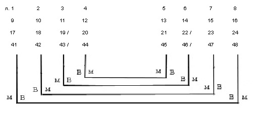
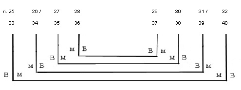
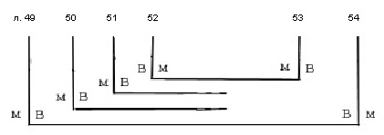
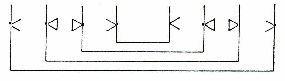

# Служебник № 519. XIII век.

Древнерусский извод.

4° (217 / 198 x 130 /120 мм). 54 л.

Без начала.

Пергамен.

Устав трех почерков: 1) л. 1 – 53; 2) л. 53 об. – 54; 3) л. 54. Добавления к тексту уставом XIV в. трех почерков: 1) на л. 10, 10 об., 11, 15, 15 об.; 2) на л. 11 об., 12; 3) на л. 3.

Сохранилась нумерация тетрадей (на нижнем поле в углу у переплета на первом листе и обороте последнего листа тетради), начиная с тетради 4‑й (на л. 8 об.) и до тетради 10‑й (на л. 49 об.). Позднейшая нумерация листов арабскими цифрами чернилами в верхнем правом углу каждого листа. Библиотечная нумерация листов карандашом на нижнем поле.

7 тетрадей: тетрадь 1 – 8 л. (л. 1 – 8), тетрадь 2 – 8 л. (л. 9 – 16), тетрадь 3 – 8 л. (л. 17 – 24; л. 19 и 22 вшивные), тетрадь 4 – 8 л. (л. 25 – 32; л. 26 и 31 вшивные), тетрадь 5 – 8 л. (л. 33 – 40), тетрадь 6 – 8 л. (л. 41 – 48; л. 43 и 46 вшивные), тетрадь 7 – 6 л. (л. 49 – 54; л. 50 и 51 вшивные).

Способ складывания пергаменных листов в тетрадях варьируется.

Тетради 1, 2, 3, 6:

Тетради 4, 5:

Тетрадь 7:

Система разлиновки:

во всех тетрадях, кроме 4‑й:

 в тетради 4‑й – система та же, но пары листов поменяли местами:

 Тип разлиновки – Leroy 00А1. 20 строк.

Поле текста: 167 /175 x 90 / 95 мм. Высота строки (основной почерк): 5 мм.

На л. 10 четырехчастная заставка с перегородками в виде плетеных контурных жгутов; в двух верхних секторах напоминающие пиктограмму контурные рисунки с элементами плетенки и тератологии и несимметричным расположением деталей; два нижних сектора заполнены кружочками; заставка выполнена чернилами, красной и желтой краской. На л. 21 и 34 заставки-плетенки чернилами и красной краской.

Более 25-ти крупных инициалов старовизантийского стиля с различными вариациями контурной плетенки; инициалы рисованы чернилами, красной и желтой краской. Некоторые инициалы с элементами тератологии (л. 32 об.), на л. 52 об. тератологический инициал.

Заголовки красной краской, в крупных заголовках первая строка выполнена контурными буквами (л. 10, 21, 34). Небольшие контурные инициалы чернилами и красной краской. На л. 4 об. при заголовке небольшие орнаментальные розетки чернилами и красной краской.

На л. 37 об. рисунки пером чернилами с изображением благословляющей руки; такие же рисунки на нижнем поле л. 28. У л. 35 и 38 нижнее поле срезано, возможно, из-за имевшихся там рисунков. На л. 54 пробы рисования плетенки пером чернилами.

Переплет исконный – доски в коже, с двумя застежками. Верхняя крышка и корешок утрачены. Размер нижней крышки: 215 / 218 x 122 / 125 мм; толщина крышки: 8 / 9 мм. Крышка без кантов. Капталы не сохранились. Крепление переплета на двух шнурах, которые выводились на внешнюю сторону крышки, затем продевались в отверстия на внутреннюю сторону и через большой «стежок» опять на внешнюю сторону под покрытие. Остатки дополнительного крепления блока книги к переплету шитьем капталов. Роль форзаца выполняет последний пергаменный лист рукописи, который прикреплен к доске ремнями застежек. Ремни застежек двойные, продеты в отверстие в крышке, затем концы ремней расправлены надвое и выполняют роль фиксатора форзаца. Замки в виде металлического кольца, которое фиксировалось на спень в торце утраченной верхней крышки.

На л. 8 закладка в виде узелка из суровой нити, закрепленной на боковом поле листа двумя крупными стежками.

Записи, наклейки, печати:

Рукой писца: на нижнем поле л. 5 красной краской – «Рука попирьна»; на нижнем поле л. 40 – «Охо, охо, охо, дремлет ми ся ... (вторая строка записи частично срезана)».

Читательские записи XIV – XV в.: на л. 33 – «Господи, спаси помози раба», на л. 53 об. и 54 – «Господи, спаси пом».

На л. 6 об. пробы пера.

На л. 1, 9, 20 скорописным почерком XIX в. – «Библиотеки Новгородскаго Софийскаго собора. 1855 года». На верхнем поле л. 1 скорописным почерком XIX в. – «XIII века».

На л. 1 печать-оттиск овальной формы с надписью: «Из библиотеки СП\[етер\]бургской Духовной Академии».

На л. 54 библиотекарская заверочная запись 1948 г.

На верхнем поле л. 1 бумажная наклейка с надписью: «№ 519. Соф.». Небольшой фрагмент такой же наклейки – на внешней стороне нижней крышки переплета.

Состояние рукописи удовлетворительное.

Шитье блока повреждено. Кожаное покрытие нижней крышки частично утрачено.

## Содержание

[Литургия Василия Великого](519_4.md) (без начала) — л. 1 – л. 9 об.

Последование начинается с поминовения живых на анафоре. Молитва «*Никтоже достоин*...» записана в конце литургии, после молитвы на «потребление Даров».

[Литургия Преждеосвященных Даров](519_6.md) — л. 10 – л. 20 об.

Озаглавлена слⷤᲂу · ст҃го поста. Такое заглавие литургия имеет во всех древнейших славянских списках, 16-ти рукописей древнерусской редакции (Слуцкий 1996 с. 121, Афанасьева 2004b с. 27). В соответствии с древнейшими уставами (как студийского типа, так и кафедральным уставом Великой церкви), днем начала служения литургии преждеосвященных Даров названа среда сыропустной недели. В отличие от большинства списков древнерусской редакции последование содержит ектению и молитву о готовящихся к просвещению.

[Чин великого освящения воды на Богоявление](519_16.md) — л. 21 – л. 33 об.

Последование относится к редакции, распространенной в древнерусской рукописной традиции до реформ Киприана, но не соответствующей предписаниям Студийско-Алексеевского устава. Указания о чтении Апостола и Евангелия отсутствует, имеется лишь

указание о чтении трех паремий. Кроме обычных молитв последование содержит пролог и так называемую молитву патриарха Софрония (Афанасьева 2004а с. 26, 36).

[Молитвы на вечерне Пятидесятницы](519_18.md) — л. 36 – л. 53.

Последование содержит три молитвы Коленопреклонения, соединенные с молитвами малых антифонов кафедральной вечерни, и молитву на преклонение глав. Такой тип последования характерен для русских служебников до реформ Киприана (Афанасьева 2003, 18–19).

[Молитва «*Господи Боже Вседержителю, сказа ковчегом образ церковный...*»](519_p47.pdf) , мелким уставом XIII в.

— л. 53 об. – л. 54.

Богослужебное указание об окончании литургии после среды крестопоклонной недели: завершение литургии преждеосвященных Даров причастным стихом «*Вкусите и видите...*» и 33-им псалмом, уставом XIV в. — л. 54.

[**Литература**](../literature.md)

Куприянов 1857, с. 102, 103

Гезен 1884, с. 33, примечание 2.

Волков 1897, № 435 с. 77

Муретов 1895a, с. 219

Орлов 1909, с. XXXI (и далее)

Лисицин 1911, с. X, 58

Розов 1979, с. 338

ПC № 361

СК № 312

Рождественская 1995, с. 305

Слуцкий 1996, с. 120–123, 125, 130

Афанасьева, Слуцкий 1999, с. 91

Афанасьева 2003, 18, 20, 21

Афанасьева 2004a, с. 26, 36

Афанасьева 2004b, с. 26 и далее.

Афанасьева 2005а, с. 202

Афанасьева 2005b, с. 20
