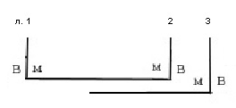
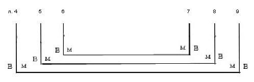
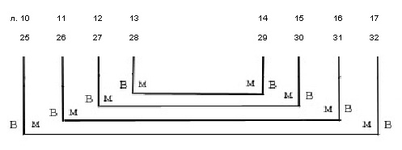
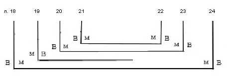
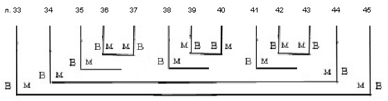
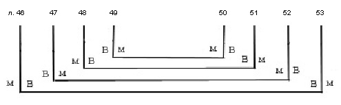
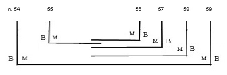
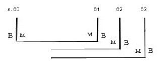
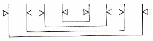

# Служебник № 520. XIV век.

Древнерусский извод.

4° (181 / 185 x 133 / 140 мм). 63 л + I л. (форзац с текстом на внутренней стороне нижней крышки переплета).

Без начала и конца, утраты листов между л. 3 и 4, л. 23 и 24 (?), л. 54 и 55 (?), л. 55 и 56 (?), л. 59 и 60 (?).

Пергамен.

Устав одной руки. На л. 23 и 49 об. дополнения текста уставом XIV в.

Нумерация тетрадей (на первом листе тетради на нижнем поле у переплета) сохранилась частично, начиная с 3‑й (на л. 4) и кончая 9‑й (на л. 54). Позднейшая нумерация листов арабскими цифрами чернилами в верхнем углу. Библиотечная нумерация карандашом на нижнем поле.

9 тетрадей: тетрадь 1 – 3 л. (л. 1 – 3; л. 3 вшивной), тетрадь 2 – 6 л. (л. 4 – 9), тетрадь 3 – 8 л. (л. 10 – 17), тетрадь 4 – 7 л. (л. 18 – 24; л. 19 вшивной), тетрадь 5 – 8 л. (л. 25 – 32), тетрадь 6 – 13 л. (л. 33 – 45; л. 35, 38, 41 вшивные; л. 36/37, 39/40, 42/43 вшивные бифолии), тетрадь 7 – 8 л. (л. 46 – 53), тетрадь 8 – 6 л. (л. 54 – 59; л. 55, 56, 57, 58 вшивные), тетрадь 9 – 4 л. (л. 60 – 63; л. 62, 63 вшивные).

Способ складывания пергаменных листов в тетрадях варьируется.

Тетрадь 1:

Тетрадь 2:

Тетради 3 и 5:

Тетрадь 4:

Тетрадь 6:

Тетрадь 7:

Тетрадь 8:

Тетрадь 9:

Система разлиновки (судя по полным тетрадям 3, 5, 7):

Тип разлиновки – Leroy 00А1. 12 строк.

Поле текста: 135 /139 x 83 / 84 мм. Высота строки: 6 мм.

На л. 41 заставка тератологического стиля, фон заполнен красной краской, контуры выполнены чернилами, узорный контур синей краской. На л. 39 об. В последней строке орнаментальная полоска чернилами и киноварью.

Около 40 крупных тонко выписанных инициалов старовизантийского стиля с различными вариациями контурной плетенки, выполненной чернилами с заполнением фона красной краской, иногда с наведением отдельных элементов узора синей краской (л. 42 и др.). В некоторых инициалах контур изящно наведен киноварью, а элементы узора обведены синей краской (л. 46). На л. 2 об., 4, 6, 8, 10, 14, 16, 17, 19, 20 об., 21, 21 об., 22 об., 27 об., 29, 30 об., 31 об., 35 об., 61 тератологические инициалы. Заголовки киноварные. Небольшие киноварные контурные инициалы, киноварные буквы в тексте.

Переплет исконный – доски в коже. Размер: 180 / 188 x 130 / 135 x 40 / 43 мм; толщина крышек: 8 / 10 мм. Доски крышек имеют наращения по периметру с трех сторон и скругление к корешку, крышки без кантов. Корешок гладкий, уплотнен дополнительной полосой кожи, которая наклеена внутри. Губочка на корешке. Сохранились остатки капталов, плетенных косичкой из суровой нити. Крепление переплета на четырех шнурах, которые продеты в отверстия в торцах крышек, выведены на внешнюю сторону крышек под покрытие и большими вертикальными стежками вновь продеты в толщу крышки. Переплет имел одну ременную застежку на металлический спень в торце верхней крышки (застежка оборвана, спень сохранился). На нижней крышке в центре металлический жук круглой формы. Шитье блока и крепление переплета повреждено, кожа покрытия частично утрачена. На внутренней стороне нижней крышки переплета выклеен форзац из бумаги, исписанной текстом канона крупным полууставом в два столбца.

Записи, наклейки, печати:

На л. 63 об. крупным полууставом – «Пречистая Богородица». На л. 44, 50, 63 об. позднейшие пробы пера. На л. 1 скорописным почерком XIX в. – «XII века».

На л. 53 на нижнем поле черными чернилами крупно – буква В. На л. 54 на боковом поле внизу читательская помета «Зри».

На л. 1 печать-оттиск овальной формы с надписью: «Из библиотеки СП\[етер\]бургской Духовной Академии».

На л. I библиотекарская заверочная запись 1948 г.

На корешке бумажная наклейка с надписью полууставом, которая стерта и не читается. Ниже позднейшая наклейка с надписью «№ 520» (частично оборвана).

На внутренней стороне верхней крышки переплета бумажная наклейка с надписью: «№ 520. Соф.».

Состояние рукописи удовлетворительное.

## Содержание

[Литургия Иоанна Златоуста](520_5.md) (без начала, с утратами) — л. 1 – л. 39 об.

Последование содержит после второй молитвы верных молитву «*Благодателю всех тварей*...», известную по итало-греческим евхологиям VIII–XI вв. как молитву входа в литургии Иоанна Златоуста. После умовения рук предписывается читать молитву «*Владыко животворяй благым дателю...*», которая известна также в итало-греческих евхологиях как молитва во время пения Херувимской песни. После чтения Символа веры читается молитва «*Господи Иисусе Христе, любви творче*...», неизвестная в греческих источниках. Перед причащением священник читает молитву «*Множества ради грехов моих не отверзи мене*...», известную по литургии ап. Иакова (Mercier 1946, p. 160).

Молитвы [«*Господи Боже наш, приими и Авалевы дары и Ноевы и Ароновы и Захарьины и Самоиловы и всех святых Твоих...*» и](520_t14.md) [«*Господи Боже наш, преложив Ся Сам...*»](520_t13.md) [—](520_t14.md) л. 40 – л. 40 об.

Первая известна по греческой литургии Иакова (Mercier 1946, p. 162), вторая из итало-греческих евхологиев VIII–XI вв. (Jacob 1970, p. 116–117).

[Литургия Василия Великого](520_4.md) (с утратами, без окончания) — л. 41 – л. 63 об.

Содержит полный состав последования, начинается с молитв антифона. В качестве молитвы Трисвятого использована молитва, которая употребляется в литургии Иоанна Златоуста в южноитальянских греческих евхологиях VIII–XII вв. (Jacob, 1970, 118–121). После Символа веры предписывается читать молитву «*Господи Иисусе Христе, любви творче*...», неизвестную в греческих источниках.

[**Литература**](../literature.md)

Куприянов 1857, с. 108

Муретов 1895a, с. 219, 221, 259

Муретов 1895b, с. 69, 97

Муретов 1897, с. 41

Petrovskij 1908, p. 883

Орлов 1909, с. XXXII (и далее)

Скабалланович 1913, с. 148

Розов 1979, с. 338

ПC № 1236

Слуцкий 2000, с. 247, 248, 249

Слуцкий 2005, с. 185, 187, 189, 190, 192, 193, 194

Афанасьева 2005b, с. 20, 21, 23, 24

Слуцкий 2006, с. 133, 134, 141
