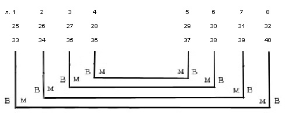
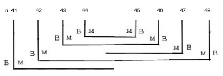
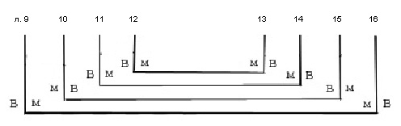
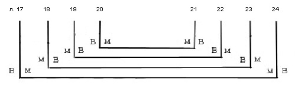
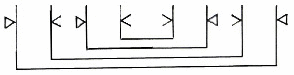

# Служебник № 521. XIV век.

Древнерусский извод, с диалектным признаком цокание.

4° (188 / 181 x 139 / 134 мм). 48 + I л.

Пергамен (л. 1 – 48). Бумага вержированная XVIII в. (л. I, вложен в рукопись).

Устав одной руки (л. 1 об. – 47). Дополнения полууставом XV в. двух почерков: 1) на л. 47 об. – 48; 2) на л. 48 об.

Нумерация тетрадей с трудом видна только на нижнем поле л. 25 (4‑я) и л. 33 (5‑я). Позднейшая нумерация листов арабскими цифрами чернилами в верхнем правом углу листов. Библиотечная нумерация карандашом на нижнем поле.

6 тетрадей: тетрадь 1 – 8 л. (л. 1 – 8), тетрадь 2 – 8 л. (л. 9 – 16), тетрадь 3 – 8 л. (л. 17 – 24), тетрадь 4 – 8 л. (л. 25 – 32), тетрадь 5 – 8 л. (л. 33 – 40), тетрадь 6 – 8 л. (л. 41 – 48, л. 41 и л. 47 вшивные).

Способ складывания пергаменных листов в тетрадях варьируется.

Тетради 1, 4, 5:

 Такой же принцип соотнесения сторон пергамена выдержан и в тетради 6, в которой л. 41 и л. 47 вшивные непарные:

Тетрадь 2:

Тетрадь 3:

Система разлиновки:

Тип разлиновки – Leroy 00А1. 15 строк (на л. 2.-2 об. верхняя линия разлиновки оставлена без текста).

Поле текста: 119 /135 x 92 / 95 мм. Высота строки (устав): 5 мм.

На л. 1 об. и л. 36 об. оставлено свободное место для заставок, которые не были нарисованы. Более 30-ти крупных инициалов старовизантийского стиля – контур буквиц выполнен киноварью (или красной краской?), фон заполнен синей краской. Небольшие буквы в тексте киноварью (или красной краской), некоторые из них контурные, с заполнением фона синей краской. Заголовки киноварь. (или красной краской). Первая строка заголовка на л. 1 об. контурными буквами с заполнением фона синей краской. Заголовок на л. 36 об. написан позднее другой рукой чернилами, первая строка контурными буквами с заполнением фона зеленой краской.

Переплет исконный – доски в коже. Размер: 189 / 190 x 139 / 140 x 45 / 48 мм; толщина крышек: 11 / 12 мм. Крышки без кантов. Корешок и покрытие нижней крышки утрачено. Капталы, плетенные из суровой нити на основе из кожи, сохранились частично. Сохранилось крепление основы каптала к торцам крышек крупными стежками суровой нити. Крепление переплета на двух ремнях, которые продеты в торцы крышек, выведены на внешнюю сторону крышек, затем на внутреннюю и закреплены в толще доски. Ремни утоплены в специально сделанных углублениях прямоугольной формы на внутренней и внешней сторонах досок. Завороты кожи покрытия закреплены на внутренней стороне верхней крышки гвоздями. Переплет имел одну застежку на металлический спень в торце верхней крышки (не сохранилась, осталась только дыра на нижней крышке). На верхней крышке частично сохранились накладные металлические защитно-декоративные элементы – небольшие жуки (диаметр ок. 7 мм), набитые перекрещивающимися диагоналями, а также по три жука в каждом углу. Всего на верхней крышке был 21 жук. На нижней крышке сохранились 2 жука – один в центре и один в верхнем углу. От других угловых жуков остались дыры. Шитье блока первоначальное, повреждено.

Записи, наклейки, печати:

На л. 48 полууставом перечень имен для поминания – «Феодора, Настасью, Тимофия, Федора, Микиту, Александра, Ульяну, Игнатья, Феодосея инока» (последнее имя дописано другой рукой).

На л. 47 скорописью – «Скречка» (?).

На корешке небольшой сохранившийся фрагмент бумажной наклейки, на которой полууставом читалось название книги, видна начальная киноварная буква «С».

На л. 2, 10, 20 скорописным почерком XIX в. – «Библиотека Новгородскаго Софийскаго собора. 1855-го года».

На л. 1 об. чернилами – «XIII века» (сверху надписано карандашом – «XIV»). Почерком основной записи л. I, вложенном в рукопись повторена датировка и зафиксировано содержание рукописи. Позднее добавлено – «К № 521/Соф.».

На л. 1 об., 2, 8 об. и бумажном л. I печать-оттиск синего цвета овальной формы с надписью: «Из библиотеки СП\[етер\]бургской Духовной Академии».

На внутренней стороне нижней крышки переплета библиотекарская заверочная запись 1948 г.

На внутренней стороне верхней крышки переплета бумажная наклейка с надписью: «№ 521 Соф.». Остатки такой же наклейки на корешке.

Состояние рукописи удовлетворительное.

Л. 1 поврежден – дыры от соприкосновения с выступающими на внутренней стороне верхней крышки прибоями жуков.

## Содержание

[Литургия Василия Великого](521_4.md) — л. 1 – л. 36.

Последование начинается молитвами *над кадилом* «*Господи Боже наш, приими Авелевы дары*» и *над Дары* «*Господи Иисусе Христе, хлеб животный, преложивыйся за мирский живот...*». Первая молитва известна по греческой литургии Иакова (Mercier 1946, p. 162). После пения Трисвятого приведена молитва «*Святе святых Боже наш, един свят на святых почиваяй...*», известная по последованию литургии Иоанна Златоуста в некоторых древнейших греческих евхологиях (древней итало-греческой редакции, Jacob, 1970 p. 118–121). В качестве заамвонной положена молитва «*Владыко Господи Иисусе Христе, Спасе наш, сподобивый ны Своея славы...*», известная по некоторым греческим евхологиям с XI в., (см. Орлов 1909, с. 306).

[Литургия преждеосвященных Даров](521_6.md) — л. 36 об. – л. 47.

Верхнее поле листа 36 об. оставлено чистым, по-видимому, оно предназначалось для декоративной заставки и начальных рубрик. Заглавие слⷤуба · ст҃го поста г҃и блгⷭьи ѡ҃це было вписано позже и весьма небрежно. Такое заглавие, «служба святого поста», литургии преждеосвященных Даров имеется во всех древнейших славянских списках, 16-ти рукописей древнерусской редакции (Слуцкий 1996, с. 121, Афанасьева 2004, с. 26). Как и в большинстве списков древнерусской редакции (12-ти из 16-ти) отсутствуют ектения и молитва о готовящихся к просвещению.

Молитва «*Господи Боже наш, един благый человеколюбец, един свят на святых почиваяй, святому апостолу Петру явльшуся ему видением...*» — л. 47 об. – л. 48. полууставом XV в.

«*Да молчит всяка плоть человеча...*», «*Ныне Силы Небесныя...*» (полные тексты гимнов) — л. 48 об. полууставом XV в.

[**Литература**](../literature.md)

Куприянов 1857, с. 107–108

Муретов 1895a, с. 219

Орлов 1909, с. XXXII (и далее)

Розов 1979, с. 338

ПC № 1237

Слуцкий 1996, с. 121–123, 127, 130

Афанасьева 2004b, с. 26 и далее

Афанасьева 2005b, с. 20
