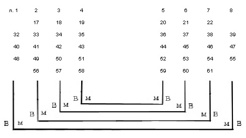
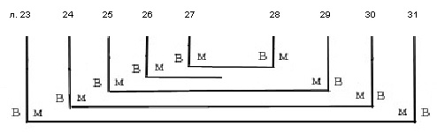
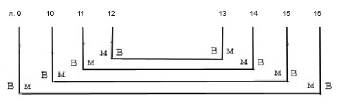
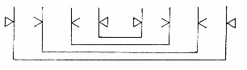
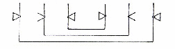
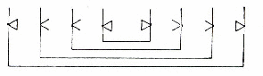
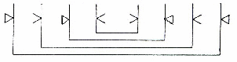
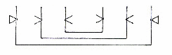

# Служебник № 522. XIV век.

Древнерусский извод.

4° (161 / 170 x 122 / 129 мм). 61 л.

Без конца.

Пергамен. Л. 26 палимпсест (?).

Устав одной руки (л. 1 об. – 61 об.). Дополнение полууставом XV в. (л. 1 – 1 об.).

На нескольких листах рукописи хорошо заметна смена чернил (л. 21 об., 25, 25 об., 27, 36, 47 об., 59 об.). Текст на вшивном л. 26 является добавлением к основному тексту, которое повлекло за собой исправления, сделанные самим писцом на л. 25, 25 об., 27.

Нумерация тетрадей не видна. Позднейшая нумерация листов арабскими цифрами чернилами в верхнем правом углу листов. Библиотечная нумерация карандашом на нижнем поле.

8 тетрадей: тетрадь 1 – 8 л. (л. 1 – 8), тетрадь 2 – 8 л. (л. 9 – 16), тетрадь 3 – 6 л. (л. 17 – 22), тетрадь 4 – 9 л. (л. 23 – 31; л. 26 вшивной, прикреплен за углы), тетрадь 5 – 8 л. (л. 32 – 39), тетрадь 6 – 8 л. (л. 40 – 47), тетрадь 7 – 8 л. (л. 48 – 55), тетрадь 8 – 6 л. (л. 56 – 61).

Способ складывания пергаменных листов в тетрадях 1, 3, 5, 6, 7, 8:

Такой же принцип соотнесения сторон пергамена выдержан и в тетради 4, в которой л. 26 вшивной непарный:

Тетрадь 2:

Система разлиновки:

в тетрадях 1, 2, 4, 7:

 в тетради 3:

в тетради 5:

в тетради 6:

 в тетради 8:

Тип разлиновки – Leroy 00А1. На л. 22 и л. 32 имеются дополнительные вертикальные линии со стороны сгиба листа (тип Leroy 10А1m), которые никакой функциональной роли при написании текста не сыграли. На л. 23 и л. 31 имеется линия верхней границы строки у верхней строки; слабые следы ее есть и на л. 24 и л. 30. На л. 26 разлиновка произведена дважды.

16 строк; на листах 2‑й тетради 17 строк, последняя нижняя линия разлиновки оставлена без текста.

Поле текста: 117 /123 x 83 / 91 мм. Высота строки (устав): 4 мм.

На л. 1 об. оставлено свободное место для заставки, которая не была нарисована, и место было заполнено полууставным текстом. Более 30-ти крупных инициалов старовизантийского стиля – контур буквиц выполнен киноварью с нерегулярным заполнением чернилами (л. 3 об., 16 об., 17), или чернилами с заполнением киноварью (л. 17 об. и др.). На л. 6 об. большой инициал плетенкой. Небольшие контурные инициалы чернилами с заполнением контура киноварью. Небольшие киноварные буквы в тексте . Заголовки киноварью. Первая строка крупных заголовков контурными чернильными буквами с заполнением киноварью. На л. 53 об. последние три буквы заголовка оставлены без заполнения киноварью.

Переплет не сохранился. Брошюровка исконная, повреждена. Блок распадается на три части. Толщина блока: 20 / 27 мм.

Записи, наклейки, печати:

На л. 2, 10, 20 скорописным почерком XIX в. – «Библиотека Новгородскаго Софийскаго собора. 1855-го года»; на л. 2 другим почерком добавлено – «61 лист».

На л. 2 об. чернилами – «XIV века». На л. 1 на нижнем поле тем же почерком – число «97»., здесь же – «Соф. б. № 522»; на боковом поле – «522».

На л. 1 печать-оттиск синего цвета овальной формы с надписью: «Из библиотеки СП\[етер\]бургской Духовной Академии».

На л. 61 об. библиотекарская заверочная запись 1948 г.

На верхнем поле л. 1 бумажная наклейка с надписью: «№ 522 Соф.».

Состояние рукописи удовлетворительное.

Рукопись имеет название мⷧотвеникъ

Замечательна тем, что с одной стороны, содержит молитвы вечерни и утрени без чинопоследования этих служб, а с другой стороны, в рукописи отдельно от молитв приводятся и сами последования (уже без молитв). Кроме того, все службы (вечерня, утреня, литургия) начинаются с возгласа «Благословенно царство...».

## Содержание

[Литургия Иоанна Златоуста](522_5.md) (без окончания) — л. 1 об. – л. 39 об.

Заглавие слⷤу ст҃го іѡ҃а ꙁлⷮаустаго.

После заглавия приведены три молитвы священника перед входом в храм:

«*Радуйся, двере небесная, радуйся, пречистая Дево...*»,

«*Непроходимая дверь тайно знаменана, благослови я, Богородице Дево...* »,

«*Пречистому Ти образу поклоняемся, благый, прощения прегрешений...*».

Далее следуют молитва перед входом в алтарь

«*Господи, кто обитает в жилище Твоем или кто вселится в горе святей Твоей...*», а также три молитвы священника «*за ся*»:

первая «*Владыко Господи Вседержителю, не хотяй смерти грешником, но обращение и живота...*»,

вторая «*Владыко Господи Боже наш, ныне хотяще приступити к страшней и чудней Твоей тайне...*»

и третья «*Господи, несмь достоин, да под кров мои внидеши...*».

Подробно описан чин проскомидии. Наряду с поименным наименованием Небесных сил, евангелистов, пророков, [приводится поименное поминание некоторых святых и Софии Премудрости Божией.](522_t3.md)

Последование не содержит особых молитв, известных по древнейшим итало-греческим евхологиям.

Описание преломление Хлеба и [соединения Даров](522_t2.md) сходно с [Соф. 520](../520/520_t8.md). Чинопоследование обрывается на молитве священнослужителей перед причащением Крови.

[Утреня](522_3.md) (без начала) — л. 40 – л. 44 об.

Приведены утренние молитвы без чинопоследования. Начало утрачено. Последование начинается с 7-ой молитвы (без начала). Далее молитвы 8‑я, 10‑я (названная в рукописи 9-ой), 11‑я (названная в рукописи 10-ой), 12‑я (названныя 11-ой) и заключительная молитва утрени «Господи святый, в вышних живый и на смиренныя призираяй...».

[Вечерня](522_1.md) — л. 45 – л. 50 об.

В рукописи имеет название млт҃въ веⷱрнꙵе.

Приведены без чинопоследования 8 вечерних молитвы. Это 1‑я, 2‑я, 3‑я, 4‑я, 7‑я светильничные молитвы современного служебника, а также нынешняя молитва входа и молитва преклонения главы. Между 4-ой и 7-ой светильничными молитвами приведена молитва «*Благословен еси, Господи Вседержителю, сведый ум человец, ведый ихже мы требуем...*»<em>.</em> Эта молитва содержится в большинстве древнейших греческих евхологиев (обычно между 4-ой и 5-ой светильничными молитвами), а также в славянских рукописных и старопечатных книгах, начиная с московского издания 1602 г. и кончая московским изданием 1652 г. (Скабалланович, II, с. 75).

[Чин вечерни](522_1a.md) — л. 50 об. – л. 53 об.

Чинопоследование вечерни без текста молитв. Начинается возгласом «Благословенно царство...» После отпуста заканчивается указанием а дьꙗⷦ станеть с правои сторⷩо҆́ ᲂу олтарѧ · держа в рⷦу ᲂуларь, по-видимому, свидетельствующем о включении вечерни в состав бдения и предваряющим последование утрени.

[Чин утрени](522_3a.md) — л. 53 об. – л. 60.

Чинопоследование утрени без текста молитв, озаглавленное сиⷰ пⷮѣ ꙁаᲂуⷮнѧꙗ. Начинается возгласом «Благословенно царство...».

Содержит указание о малых ектениях на 4-ой и на 7-ой песни канона, что соответствует обычной схеме утрени, поскольку термины «на 4-ой» и «на 7-ой» по-видимому тождественны указаниям «по 3-ей» и «по 6-ой» (см. [утреню в Соф. 531](../531/531_3.md)). В конце, после отпуста, содержится краткий молебен в неⷣ или въ ст҃҃ыи дн҃ъ.

[Панихида](522_2.md) (без окончания) — л. 60 – л. 62 об.

Озаглавлена мⷧо на панахидѣ, состоит их трех молитв и ектении.

Три молитвы «*Господи, Господи, утешение скорбящим и плачущимся увет, малодушным помощник...*»,

«*Благодарим Тя, Господи человеколюбче, яко Тебе единому живот бесмертен и слава непостыжна*...»,

«*Владыко Господи Боже наш, имея бесмертьство, живыи в свете непреступнем, умершая и оживляя, и изводя*...»,

в настоящее время входят в состав службы погребения священника, являясь в этой службе соответственно молитвами 3-го, 2-го и 1-го антифонов. Все три молитвы встречаются в древнейших евхологиях, в частности, первая и третья находятся в древнейшем евхологии VIII в. *Barberini 336,* а вторая в гроттаферратском кодексе XI в. Γ.β.I.

[**Литература**](../literature.md)

Куприянов 1857, с. 108

Муретов 1895a, с. 229, 230, 238, 239, 240, 244, 257, 258, 260, 261, 262

Муретов 1895b, с. 69, 75, 76, 95, 97–99

Муретов 1897, с. 77, 87, 97

Petrovskij 1908, p. 879–885

Скабалланович 1913, с. 207

Арранц 1979, с. 97, 125, 193, 217

Розов 1979, с. 338

ПC № 1238

Слуцкий 2000, с. 246

Афанасьева 2005b, с. 20

Слуцкий 2006, с. 134
