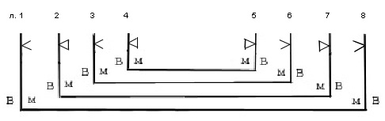
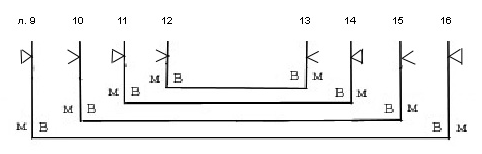
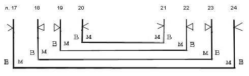
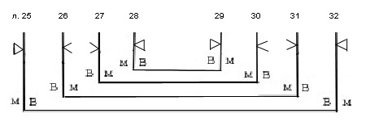
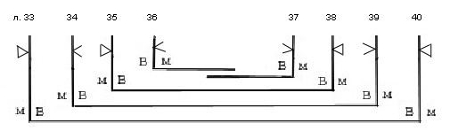
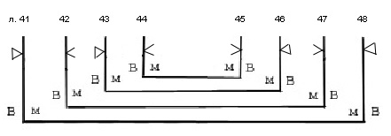
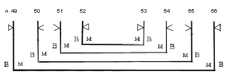
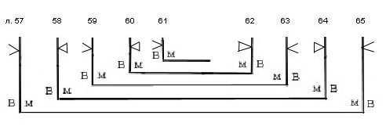
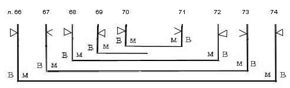
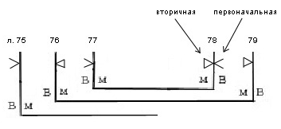

# Служебник № 523. XIV век.

Древнерусский извод.

4° (181 / 176 x 138 / 132 мм). 79 л.

Пергамен. Л. 78, 79 – палимпсест (?).

Устав одной руки (л. 1 об. – 77). Дополнения разными почерками: 1) уставом (на боковом и нижнем поле л. 34 об.); 2) уставом с вычурно написанной якорной «е» (л. 77 об. – 79); 3) полууставом XV в. (л. 1 об.); 4) полууставом XVI в. (л. 1).

На л. 78 соскабливание первоначального текста, очевидно, привело к повреждению материала, в результате чего испорченный участок листа был вырезан (лакуна 110 x 60 мм) и заклеен «заплаткой» из пергамена (142 x 97 мм), после этого была сделана повторная разлиновка и написан текст. В 5‑й строке текста на этом листе хорошо заметна смена чернил (при том, что почерк не меняется).

Нумерация тетрадей не видна. Позднейшая нумерация листов арабскими цифрами чернилами в верхнем правом углу листов. Библиотечная нумерация карандашом на нижнем поле.

10 тетрадей: тетрадь 1 – 8 л. (л. 1 – 8), тетрадь 2 – 8 л. (л. 9 – 16), тетрадь 3 – 8 л. (л. 17 – 24), тетрадь 4 – 8 л. (л. 25 – 32), тетрадь 5 – 8 л. (л. 33 – 40; л. 36 и л. 37 вшивные), тетрадь 6 – 8 л. (л. 41 – 48), тетрадь 7 – 8 л. (л. 49 – 56), тетрадь 8 – 9 л. (л. 57 – 65; л. 61 вшивной), тетрадь 9 – 9 л. (л. 66 – 74; л. 69 вшивной), тетрадь 10 – 5 л. (л. 75 – 79; л. 75 вшивной).

Способ складывания пергаменных листов в тетрадях и система разлиновки варьируются:

Тетрадь 1:

 Тетрадь 2:

Тетрадь 3:

Тетрадь 4:

 Тетрадь 5:

 Тетрадь 6:

Тетрадь 7:

Тетрадь 8:

Тетрадь 9.

Тетрадь 10, в которой на л. 78 «заплатка» приклеена без соблюдения соответствия сторон пергамена основному листу:

Тип разлиновки – Leroy 00А1. На л. 78 и 79 разлиновка произведена дважды. Двойные линии проколов для разлиновки: одна – точечными проколами, другая – прорезами длиной ок 2 мм. На некоторых листах линии разлиновки (особенно вертикальные) прорезали пергамен, разрезы зашиты крупными стежками (л. 48, 74). У л. 66 прорез по вертикальной линии, ограничивающей внутреннее боковое поле, и утрата внешнего бокового поля вследствие прореза при разлиновке.

15 строк; на листах 6‑й, 7‑й, 8‑й, 91‑й тетрадей, а также на л. 25 и 32 в 4‑й тетради 17 строк (на л. 25 две строки разлиновки не заполнены текстом, на л. 32 об. Одна строка разлиновки не заполнена текстом); число строк в дополнениях к тексту доходит до 18-ти. (л. 78).

Поле текста: 128 /138 x 83 / 86 мм. Высота строки (устав): 4 мм.

На л. 1 об. оставлено свободное место для заставки, которая не была нарисована, и часть свободного пространства листа была заполнена полууставным дополнением. Более 60-ти крупных контурных инициалов старовизантийского стиля, некоторые с элементом плетенки. Контур буквиц выполнен киноварью, четыре инициала нарисованы чернилами. Небольшие контурные инициалы киноварью. Небольшие киноварные буквы в тексте. Заголовки на л. 50 об., 59, 70 об., 74 контурными киноварными буквами; другие заголовки киноварью или чернилами с киноварными начальными буквами слов.

Переплет кон. XV – XVI в. – доски в коже со следами тиснения, с двумя застежками. Размер: 190 / 172 x 140 x 50 мм; толщина крышек: 9 /10 мм. Крышки без кантов, корешок гладкий (однако из-за того, что кожа покрытия тонкая, крепления несколько выступают на корешке), под кожей покрытия укреплен полотняной тканью. Два плетеных каптала на корешке. Губочка на корешке, прикрывающая каптал. Крепление переплета на четырех шнурах, которые продеты в торцы крышек и закреплены на внешних сторонах под покрытием. Завороты кожи покрытия выклеены на внутренних сторонах крышек. Без форзацев. На внешней стороне обеих крышек видны следы примитивного тиснения дорожником по периметру и по диагоналям, перекрещивающимся в центре. На нижней крышке сохранились четыре фигурные жука по углам, в центре дыры от утраченного круглого жука. На верхней крышке множество отверстий. Это позволяет предположить, что фигурные накладные защитно-декоративные элементы находились по углам, в центре, а также на середине всех четырех сторон крышек. Две застежки – металлическое кольцо, накидывающееся на металлический спень (сохранился спень только от одной застежки) в торце верхней крышки; на двойных ремнях, плетеных косичкой из полос кожи, продетых в отверстия на нижней крышке и закрепленных на внутренней стороне нижней крышки.

Записи, наклейки, печати:

На л. 11 об. На боковом поле пробы пера в виде написаний отдельных букв (рукой писца ?).

На внутренней стороне верхней крышки переплета (по доске) скорописью чернилами – «На одной просфоре». Здесь же карандашом – «Воспомин. праздник Знамения». Здесь же черными чернилами – «523», а также наклейка с шифром – «№ 423. Соф.».

На л. 1 скорописным почерком – «XIV века».

На л. 2 две печати-оттиска синего цвета овальной формы с надписью: «Из библиотеки СП\[етер\]бургской Духовной Академии».

На внутренней стороне нижней крышки библиотекарская заверочная запись 1943 г.

К рукописи приложен лист вержированной бумаги, на котором скорописным почерком XVIII в. приведен состав Служебника с указанием порядкового номера статьи и соответствующего листа рукописи. В верхней графе написано – «Век XIII». На этом же листе внизу сделано добавление мелким почерком ΧΙΧ в. – «Воспом. Борис и Глеб, Владимир, Вячеслав, Михаил и Феодор (1238 г.)».

Состояние рукописи удовлетворительное.

## Содержание

Молитва *над вином служебным* «*Господи, Боже, благый и человеколюбче, призри на вино се, и вкушающих от него благослови е яко благословил еси купель силуамскую...*» — л. 1. почерком XVI в.

[Литургия Иоанна Златоуста](523_5.md) — л. 1 об. – 50 об.

В верхней части листа 1 об. оставлено пустое место для заставки и заглавия. Позже это место было частично записано текстом гимна «Иже херувимы...» полууставом XV в.

Последование начинается с трех молитв священника перед литургией. Первые две молитвы совпадают с первыми двумя молитвами священника «*за ся*» из [Соф. 522,](../522/522_0.md) третьей приведена молитва «*Боже Вседержителю, великоименитый Господи, давый нам вход в святая святых пришествием единочадаго Сына Твоего...*».

Далее следует проскомидия. При вливании вина и воды в потир произносится «*Соединение святаго Духа и ныне...*».

Содержит, в частности, поминовение *новоявленую мученику* [Бориса и Глеба и князей Владимира, Вячеслава, Михаила и Федора.](523_t4.md)

После Великого входа указана молитва «*Владыко животворяй, благим дателю...*», известная в итало-греческой литургии Иоанна Златоуста как молитва Херувимской песни (Jacob.1970, с. 125). Последование заканчивается молитвой «*Господи Боже наш, приими умаленную нашу молитву...*», завершающей последование литургии Иоанна Златоуста в Синайском глаголическом служебнике XI в. (Афанасьева. 2005b, с. 21–22.)

[Вечерня](523_1.md) — л. 50 об. – л. 58 об.

Служба озаглавлена млт҃вы вечерни на всѧкъ дн҃ь .

Начинается семью светильничными молитвами, шесть соответствуют современному служебнику, между четвертой и пятой имеется молитва «*Благословен еси, Господи Вседержителю, сведый ум человеч, ведый, ихже мы требуем*...» (об этой молитве см. описание вечерни в [Соф. 522](../522/522_0.md#DDE_LINK1)). Седьмая светильничная молитва современного служебника приводится после «*Сподоби, Господи*...».

Имеются также молитва входа «*Вечер, заутра, полудни*...» и молитва на главопреклонение.

[Утреня](523_3.md) — л. 59 – л. 70 об.

Служба озаглавлена млт҃вы на всѧⷦ дн҃ь · ꙁаⷮ. Начальный возглас: «Благословенно царство...».

Приведены 11 из 12-ти молитв современной утрени. Отсутствует 9‑я молитва, она, как правило, отсутствует и в древнейших евхологиях. В соответствии с обычной схемой песненной утрени в древнейших евхологиях (Арранц 1979, с. 67) 10‑я молитва соответствует 50-му псалму, 11‑я — хвалитным (псалмы 148–150).

[Молитвы по вечерни на молебнах](523_13.md) — л. 70 об. – л. 74.

Служба озаглавлена млт҃вы по вⷱерниі ѥгда поⷮю · канꙵу

Последование содержит четыре молитвы.

[Панихида](523_2.md) — л. 74. – л. 77.

В рукописи имеет название млт҃вꙑ на понахіⷣ

Начальный возглас: «Благословен Христос, Бог наш...».

После указания о чтении 90-го псалма приводятся три молитвы, совпадающие с молитвами последования панихиды из Соф. 522 (об этих молитвах см. описание панихиды в [Соф. 522](../522/522_0.md) ) В Соф. 522 далее после этих молитв утрата листов, в Соф. 523 после молитв приведен текст заупокойной ектении и окончание последования (указания о пении тропаря «*Глубиною мудрости...*»<em>,</em> о пении «*Блажени непорочны...*» и канона (по 50-ом псалме).

Молитва заамвонная на Пасху — л. 77 об. – л. 78.

Заамвонная молитва на Пасху наиболее часто встречается в рукописных славянских служебниках

именно (выявлено 12 списков этой молитвы, Слуцкий 2005, с. 191, 192). Расположение данной молитвы в конце рукописи, отдельно от чинопоследования литургии, является обычным как в греческой, так и в славянской рукописной традиции.

Славянская заамвонная молитва на Пасху опубликована в книге Орлов 1909 (по списку Соф. 524, но в аппарате указаны чтения Соф. 523) и в статье Слуцкий 2005. с. 192–194 (по служебнику Рум. 398 из РГБ, чтения Соф. 523 также приводятся в аппарате, наряду с другими 11‑ю списками).

Прокимны воскресные — л. 78 об. – л. 79 об.

[**Литература**](../literature.md)

Куприянов 1857, с. 108–109

Муретов 1895a, с. 42, 227, 230, 231, 236, 238, 239, 240, 245, 257, 258, 261, 262

Муретов 1895b, с. 69, 82–85

Муретов 1897, с. 25–28, 29, 39–40

Petrovskij 1908, p. 880–885

Арранц 1979, с. 108–109

Розов 1979, с. 338

ПC № 1479

Слуцкий 2000, с. 246, 248

Слуцкий 2005, с. 185, 187, 192, 193, 194

Афанасьева 2005а, с. 202

Афанасьева 2005b, с. 20, 21

Слуцкий 2006, с. 132, 133, 136, 137, 141
