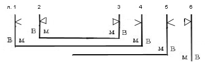
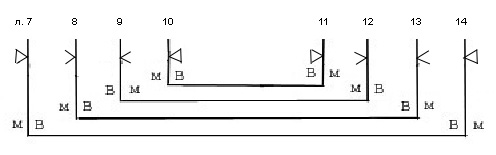
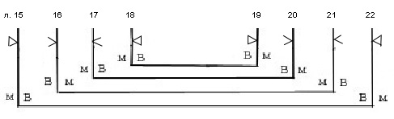
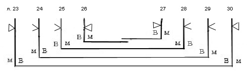
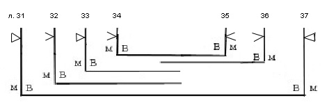
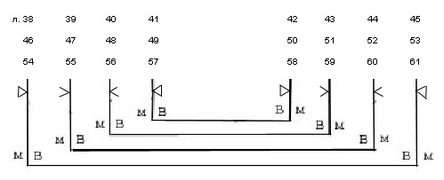
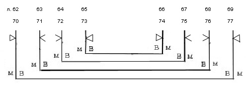
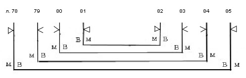
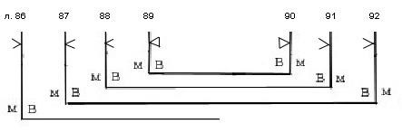

# Служебник № 524. XIV век.

Древнерусский извод.

8° (156 / 140 x 118 / 108 мм). 92 л.

Без нач. и кон., утраты листов между л. 6 и 7, 61 и 62 (2 тетради).

Пергамен.

Устав 5-ти почерков: 1) л. 1 – 21, 54 – 61 об., мелкий устав той же руки на л. 62 – 69 об.; 2) л. 21 об. – 53 об.; 3) мелкий устав на л. 70 – 85 об.; 4) л. 86 – 92.; 5) л. 92 – 92 об.

Нумерация тетрадей (киноварью или чернилами на нижнем поле в углу у корешка на первом и обороте последнего листа тетради): с 4‑й (на л. 22 об.) по 9‑ю (на л. 54); с 12‑й (на л. 55) по 14‑ю (на л. 78). Позднейшая нумерация листов арабскими цифрами чернилами на нижнем поле ближе к боковому обрезу. Библиотечная нумерация карандашом на нижнем поле.

12 тетрадей: тетрадь 1 – 6 л. (л. 1 – 6; л. 5 и 6 вшивные), тетрадь 2 – 8 л. (л. 7 – 14), тетрадь 3 – 8 л. (л. 15 – 22), тетрадь 4 – 8 л. (л. 23 – 30; л. 26 и 27 вшивные), тетрадь 5 – 7 л. (л. 31 – 37; л. 32, 33, 36 вшивные), тетрадь 6 – 8 л. (л. 38 – 45), тетрадь 7 – 8 л. (л. 46 – 53), тетрадь 8 – 8 л. (л. 54 – 61), тетрадь 9 – 8 л. (л. 62 – 69), тетрадь 10 – 8 л. (л. 70 – 77), тетрадь 11 – 8 л. (л. 78 – 85), тетрадь 12 – 7 л. (л. 86 – 92; л. 86 вшивной).

Способ складывания пергаменных листов в тетрадях и система разлиновки не одинаковы.

Тетрадь 1:

Тетрадь 2:

Тетрадь 3:

 Тетрадь 4:

 Тетрадь 5:

Тетради 6, 7, 8:

Тетради 9, 10:

Тетрадь 11:

Тетрадь 12:

Тип разлиновки – Leroy 20D1 (тетради 1 – 3) и 00А1 (тетради 4 – 12).

Число строк, поле текста и высота строки различаются в зависимости от почерков.

Л. 1 – 61 – 12 строк (на л. 54 заполнены текстом 10 строк, 2 строки разлиновки оставлены без текста). Поле текста: 103 / 110 x 70 / 77 мм. Высота строки: 4 / 5 мм.

Л. 62 – 69 – 19 строк (на л. 63 и 63 об. 18 строк). Поле текста: 100 /105 x 70 / 78 мм. Высота строки – 4 / 3 мм.

Л. 69 – 85 – 23–25 строк. Поле текста: 112 / 125 x 79 / 83 мм. Высота строки: 3 мм.

Л. 86 – 92 – 13–15 строк. Поле текста: 107 / 117 x 74 /76 мм. Высота строки: 4 мм (4‑й почерк) / 3 мм (5‑й почерк).

Около 60-ти крупных инициалов тератологического стиля (на л. 1 – 69 контуры и фоны киноварные; на л. 70 – 85 контуры чернилами, заполнения киноварью; на л. 86 – 92 небольшие контурные инициалы чернилами). Небольшие киноварные буквы в тексте. Крупные заголовки киноварные, контур букв чернилами.

Переплет – доски без покрытия (которое не сохранилось), с одной застежкой (утрачена). Размер: 157 / 160 x 113 / 115 x 58 / 59 мм. Толщина крышек: 10 мм.

Крышки без кантов, корешок утрачен. Следы крепления капталов к крышкам (дыры). Крепление переплета на двух ремнях, которые продеты в торцы крышек, затем выведены на внешнюю сторону в специальные углубления (где были закреплены гвоздями), затем концы ремней зажаты в сквозных пропилах в крышках (что видно с внутренней стороны крышек). Брошюровка повреждена, блок распадается на тетради. На нижней крышке в центре и по углам отверстия от утраченных металлических защитно-декоративных элементов.

Записи, наклейки, печати:

На л. 1 на нижнем поле скорописью – «Деревяницкого монастыря»; на верхнем поле скорописным почерком коричневыми чернилами – «XIV века»; здесь же черными чернилами – «XIII»; на боковом поле скорописным почерком – «Соф. Библ. № 524. Ив. Челыщ. (?)».

На л. 2, 10, 20 черными чернилами крупно – «Библиотеки Новгородскаго Софийскаго собора. 1855 года».

На внутренней стороне верхней крышки переплета (по доске) крупно скорописью чернилами – «На одной просвире» (перечеркнуто крестообразными линиями черными чернилами). Здесь же библиотекарская заверочная запись 1912 г. , а также черными чернилами – «XIII».

На л. 1 печать-оттиск синего цвета овальной формы с надписью: «Из библиотеки СП\[етер\]бургской Духовной Академии».

На внешней и внутренней сторонах верхней крышки переплета идентичные наклейки с надписью – «№ 524. Соф.».

Состояние рукописи плохое. Пергамен покороблен. Вследствие воздействия влаги на многих листах поврежден текст. Блок распадается. Л. 6 выпадает. У л. 54 оторван верхний угол, частично утрачен инициал и текст.

## Содержание

[Литургия Иоанна Златоуста](524_5.md) — л. 1 – л. 54.

Заглавие и начало службы отсутствуют. Последование начинается с проскомидии. Литургия имеет подробное описание причащения священнослужителей и народа, а также окончания литургии.

[Вечерня](524_1.md) (без окончания) — л. 54 об. – л. 61 об.

Начинается светильничными молитвами, пять соответствуют современному служебнику, между третьей и четвертой имеется молитва «*Благословен еси, Господи Вседержителю, сведый ум человец, ведый, ихже мы требуем*...» (об этой молитве см. описание вечерни в [Соф. 522](../522/522_0.md#DDE_LINK1)). Состоит из восьми молитв, последование обрывается на следующей за прокимном сугубой ектении.

[Утреня](524_3.md) (без начала) — л. 62 – л. 63.

Начальные молитвы утрачены. Служба начинается с середины 12‑й молитвы утрени.

[Врачевальные молитвы](524_11.md) — л. 63 – л. 65.

Цикл из 5-ти молитв. Более пространный цикл (из 12-ти молитв), включающий эти молитвы, имеется в Соф. 869. и

опубликован в: Алмазов 1900, с. 105–110.

[Чин исповедания](524_10.md) — л. 65 – л. 73 об.

Последование относится к первой редакции чина исповеди по классификации А.И. Алмазова.

Состоит из начальных покаянных тропарей, вопросников для мужчин и женщин, пяти исповедальных и трех поисповедных молитв

(cм.: Алмазов 1894. Т. I. с. 236–242). Вопросники опубликованы в книге Карагодина 2006. с. 408–409, 457–458.

[Последование к причащению](524_32.md) — л. 73 об. – л. 75 об.

Состоит из четырех молитв.

Молитвы *в пост идуще* — л. 75 об. – л. 76 об.

Две молитвы:

первая: «*Надеяние всех конец земли и сущим в море дальним...*»,

вторая: «*Благословен еси, Господи Боже отец наших, сдержай вся, Боже Авраамов, Боже Исаков, Боже Иаковль...*»

Молитвы, *скончащия пост* — л. 76 об. – л. 80 об.

Цикл из пяти молитв:

«*Господи Иисусе Христе, Боже наш, створивый от небытия в бытие все видимое и невидимое, благословивый Авраама, Исака и Иакова...*»

молитва 2 «*Владыко Господи человеколюбче, молимся о сих недостоиныих рабех Твоих...*»

молитва *на воскресенье Христово изговевшеся* «*Владыко Господи Боже наш, сподобивый ны преити святаго поста...*»

молитва 2 *тому ж* «*Единочадый Сын Божий, показавый учеником славу Своего божества...*»

молитва *на Рождество Христово изговевшеся* «*Владыко Господи Боже Вседержителю, рожийся от девици Марии в Вифлиоме июдеистем...*»<em>.</em>

Некоторые из этих молитв, входящие в цикл «Молитвы в пост идущи детем духовным», имеются в Соф. 849, л. 201 – л. 206.

См. Алмазов 1894, Т. II. c. 238–240.

Молитва заамвонная на святую Пасху «С<em>ветлый нам спасеный день воссия, братие...</em>» — л. 80 об. – л. 81.

Опубликована по данному списку в книге М. Орлов Литургия св. Василия Великого. СПб. 1909 с. 344, 346.

Является наиболее распространенной в славянских служебниках из всех дополнительных заамвонных молитв литургии.

(Обнаружено 12 списков этой молитвы, см. Слуцкий 2005, с. 191, 192.)

Устав пасхальной службы «*В святую неделю Пасхи*...» — л. 81 об. – л. 83 об.

Последование над *осквернившимся во сне от беса* — л. 83 об. – л. 84.

... 50‑й псалом (без текста), «*Святый Боже*»<em>,</em> «*Пресвятая Троице*»<em>,</em> «*Отче наш*»<em>,</em> «*Господи помилуй*» *50 раз,*

*тропарь ..., Богородице ... 50 поклонов и молитва* «*Боже Иисусе Христе Боже наш, ... божиим даром Отца...*»

Молитва *от всякоя скверны* «*Владыко Господи Боже наш, единый благий человеколюбец, един свят на святых почивая, верховнему апостолу Твоему Петрови явльшуся видениим...*» — л. 84 – л. 84 об.

Молитва *над сосудом осквернившемся* «*Господи Боже наш, рек...*» — л. 84 об.

Молитва *начати вино кисело и мед* «*Господи Иисусе Христе Боже наш, преложивый воду в вино в Кана Галилеистем...*» — л. 85.

Имеется в требнике Кир.-Бел. 528/785, л. 292 из РНБ и опубликована по этому списку в: Алмазов 1896, с. 35.

Молитва *на обручение девици мужеви* «*Господи Боже наш, поручивый язычную церковь...*» — л. 85.

Молитва над *цветы в* *вербничю* «*Господи Боже Вседержителю, сказавый ковчегом образ церковный...*» — л. 85 – л. 85 об.

Молитва над сыром на Пасху «*Благослови, Господи, тварь млечную, да будет яко на спасение врачьство роду человеческому...*» — л. 85 об.

Молитва *сердечная* «*Олам, селам, варгофа, фиварес, таже глаголи сие...*» — л. 85 об.

Та же молитва имеется в Соф. 845. л. 238 об. – л. 239. и опубликована по этому списку в: Алмазов 1900, с. 119.

Молитва на основание церкви «*Господи Боже наш, изволивой на сем камни создати церковь...*» — л. 86 – л. 86 об.

Молитвы на очищение церкви *иже осквернить от еретика* — л. 87 – л. 88.

«*Владыко Господи Боже наш, молим Тя, милостиваго помощника, о гресех наших...*»

«*Господи Вседержителю, прообразивый мосеовою палицею честнаго и животворящего креста...*»

Молитва отходящим на воину «*Владыко Господи Отче наших, Тебе просим и Тебе ся молим...*» — л. 88 – л. 89 об.

Молитва над *кровью многотекущь носом и усты* «*Источиваю кровь язвою из ребер Твоих, Христе Боже наш...*» — л. 90 – л. 90 об.

Имеется в Соф. 836, л. 229 и опубликована по этому списку в: Алмазов 1900, с. 116–117.

Молитва *егда змия уясть ли пес бесный* «*Господи Боже наш, егоже имя святое и милость бесчислена...*» — л. 90 об. – л. 91.

Имеется в Погод. 308, л. 353 об.-354, опубликована по этому списку в: Алмазов 1900, с. 124.

Молитва на *основание храму нову* «*На всяком месте владычествия Твоего...*» — л. 91 – л. 92.

Молитва на *заколение быка* «*Благословен еси, Господи Боже Отче наших, и благословено имя славы Твоея...*» л. 92 – л. 92 об.

Имеется в Соф. 845, л. 241 об., Соф. 836, л. 523 – л. 523 об., опубликована в: Алмазов 1896, с. 38.

[**Литература**](../literature.md)

Куприянов 1857, с. 103–104

Муретов 1895a, с. 42, 219, 226, 236, 239, 240, 244, 258, 260, 261

Муретов 1895b, с. 66–67, 94–97

Муретов 1897, с. 10–11, 29, 37–39

Скабалланович 1913, с. 74, 131

Petrovskij 1908, p. 874–878

Арранц 1979, с. 55

Розов 1979, с. 338

Слуцкий 2000 246, 247, 248, 254

Слуцкий 2005, с. 185, 187, 192, 193, 194

Афанасьева 2005b, с. 20

Слуцкий 2006, с. 131, 132, 141
