# Служебник № 525. XIV — XVI век.

Кон. XIV – нач. XV в. (л. 7 – 48), перв. треть XV в. (л. 70 – 81). втор. четв. XV в. (л. 50 – 69 об.), серед. – трет. четв. XV в. (л. 1 – 5, 86 – 91), 70–80-х гг. XV в. (л. 6 – 6 об.), серед. XVI в. (дополнения на л. 6 об., 48 – 49 и на полях других листов).

Древнерусский извод, со вторым южнославянским влиянием (л. 1 – 6 об., 50 – 69 об., 81 – 91 об.).

4° (185 / 194 x 138 / 146 мм). 91 л.

Без нач. и кон., утраты листов в нескольких местах в разных частях блока.

Пергамен (л. 6 – 85), л. 6, 11, 48 – 65, 81 – 85 – палимпсест; бумага (л. 1 – 5, 86 – 91), филигрань: Голова быка – типа Брике 14547 (1454 г.).

Нижний слой палимпсеста – кириллический текст, недалеко отстоящий по времени от верхнего, о чем свидетельствует стилистическая близость оформления текстов обоих слоев (см. остатки смытого киноварного заголовка на л. 48 и контурных киноварных инициалов на л. 52, 58, 59, 60, 80).

Устав (л. 7 – 48), устав с элементами полуустава (л. 70 – 81), полуустав нескольких почерков: 1) л. 1 – 5 об., 86 – 91 об.;2) с элементами скорописи – л. 6 об., 49 об.; 3) л. 48 – 49, дополнения на л. 10 об. – 21, 50 – 58, 70 об. –73, 74 об.; 4) л. 50 – 69 об., 81 об. – 85 об., дополнения на л. 7 об., 8, 21 об., 22, 39 об.

Нумерация тетрадей (полууставным почерком чернилами на нижнем поле на обороте последнего листа тетрадей), начиная с 1‑й (на л. 16 об.) по 9‑ю (на л. 77 об.). Позднейшая нумерация листов арабскими цифрами чернилами в верхнем правом углу листов. Библиотечная нумерация карандашом на нижнем поле.

11 тетрадей: тетрадь 1 – 16 л. (л. 1 – 16; л. 1 – 5 вшивные бумажные, л. 11, 13, 16 вшивные), тетрадь 2 – 8 л. (л. 17 – 24, вшита в фалец), тетрадь 3 – 8 л. (л. 25 – 32), тетрадь 4 – 5 л. (л. 33 – 37; л. 35 вшивной), тетрадь 5 – 6 л. (л. 38 – 44; л. 39, 42, 44 вшивные), тетрадь 6 – 5 л. (л. 45 – 49, л. 49 вшивной), тетрадь 7 – 8 л. (л. 50 – 57), тетрадь 8 – 8 л. (л. 58 – 65), тетрадь 9 – 4 л. (л. 66 – 69), тетрадь 10 – 8 л. (л. 70 – 77), тетрадь 11 – 14 л. (л. 78 – 91; л. 84/85 вшивной бифолий, л. 86–91 вшивные бумажные).

Способ складывания пергаменных листов в тетрадях и система разлиновки не одинаковы.

Тетрадь 1:

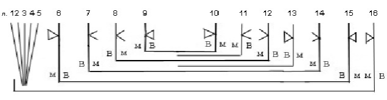

Тетрадь 2:

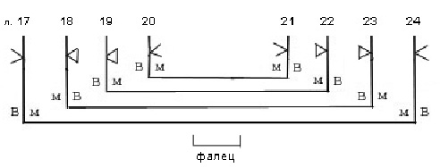

Тетрадь 3:

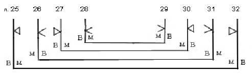

Тетрадь 4:

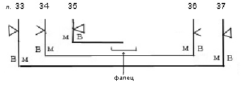

Тетрадь 5:

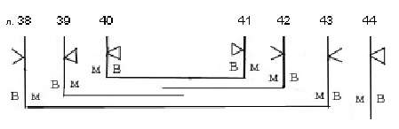

Тетрадь 6:

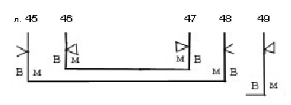

Тетрадь 7 (разлиновка не видна):

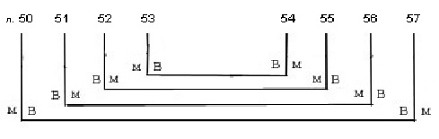

Тетрадь 8 (разлиновка почти не видна):

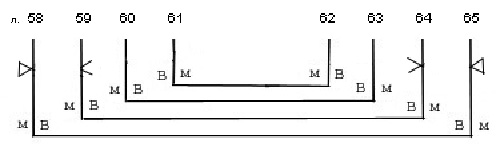

Тетрадь 9:

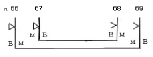

Тетрадь 10:

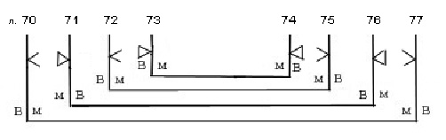
 Тетрадь 11:

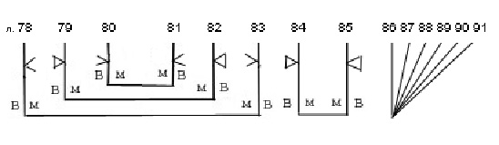

Тип разлиновки – Leroy 00А1 и Leroy 20D1 (л. 84 и 85). На л. 66 – 69 тип разлиновки отличается строгим соблюдением границ поля текста – вертикальные и горизонтальные линии не продолжаются на полях, будучи ограниченными точкой пересечения; предварительная разметка строк сделана не проколами у края листа, а точечными вмятинами в области вертикальных линий, являющихся боковыми границами поля текста. Эти 4 листа образуют отдельную тетрадь, которая, однако, не пронумерована и помещена между тетрадями, имеющими проставленные буквенной цифирью номера 8 и 9.

Число строк, поле текста и высота строки различаются в зависимости от почерков.

Параметры основных блоков кодекса:

Л. 7 – 47 – 13 строк (на л. 16 об. – 14 строк). Поле текста: 135 / 138 x 95 мм. Высота строки: 5 мм.

Л. 70 – 80 – 13 строк. Поле текста: 132 / 136 x 92./ 95 мм. Высота строки: 5 мм.

Л. 50 – 65 – 13 строк. Поле текста: 127 /137 x 96 / 102 мм. Высота строки: 4 / 5 мм.

Л. 66 – 69 – 15 строк. Поле текста: 127 / 130 x 85 / 88 мм. Высота строки: 4 мм.

Л. 82 – 85 – 18 /19 строк. Поле текста: 148 /154 x 100 / 110 мм (промеры не по разлиновке, которая осталась от первоначального текста, а по длине строк). Высота строки: 3 / 4 мм.

В части рукописи, написанной уставом, более 20-ти киноварных контурных инициалов старовизантийского стиля, заголовки киноварью, небольшие киноварные буквы в тексте. В части, написанной уставом с элементами полуустава, крупные контурные инициалы старовизантийского стиля, в некоторых из них контур выполнен чернилами с заполнением киноварью. Заголовки киноварные, в крупных заголовках в первой строке буквы киноварные контурные (л. 70 об.) или киноварные с чернильным контуром (л. 72 об.). Небольшие киноварные буквы в тексте. В частях рукописи, написанных полууставом, тонкие киноварные инициалы, некоторые орнаментированы. Заголовки киноварные. Небольшие киноварные буквы в тексте.

Переплет XVI в. – в сумку, из сыромятной кожи, с одной завязкой из кожаного шнура (оборвана). Размер: 160 / 187 x 120 / 142 x 37 мм. Толщина крышки: 1 мм.

Нижняя крышка составлена из кусочков, сшитых крупными стежками. Корешок глухой. Крепление переплета на трех шнурах. Клапан оборван.

Записи, наклейки, печати:

На л. 7, 10, 22 черными чернилами крупно – «Библиотеки Новгородскаго Софийскаго собора. 1855 года».На л. 1 на нижнем поле черными чернилами мелко – «XIII и XV».

На л. 7 на верхнем поле скорописным почерком коричневыми чернилами – «XIV века».

На л. 1, 85 об. печать-оттиск синего цвета овальной формы с надписью: «Из библиотеки СП\[етер\]бургской Духовной Академии» (на л. 85 об. Надпись не читается).

На л. 90 об. библиотекарская заверочная запись 1948 г.

На корешке две бумажные наклейки: верхняя с надписью скорописным почерком – «№ 21 (зачеркнуто и доб. № 525). Служебник на пергаменте. XIV в.»; на нижней – шифр (сорвана).

На внутренней стороне верхней крышки переплета наклейка с надписью – «№ 525. Соф.».

Состояние рукописи плохое. Пергамен покороблен. Распад бумаги, на бумажных листах вследствие ветхости частично утрачен текст, края листов затрепаны. Л. 44 порван, выпадает из блока.

## Содержание

Молитва покаянная перед литургией (заглавие утрачено, текст частично утрачен) — л. 1 – л. 1 об. на бумаге полууставом третьей четв. XV в.

Молитва (текст частично утрачен) *пред Евангелием* «*Господи, Боже наш, приклони сердца нашу в послушание божественных Ти повелений...*» — л. 1 об. – л. 2. на бумаге полууставом третьей четв. XV в.

Молитва (текст частично утрачен) *по Апостоле пред Евангелием молитва преклонь главу* «*Восиаи сердцих наших мысленое солнце правды Твоея и просвети ум наш...*» — л. 2 – л. 2 об. на бумаге полууставом третьей четв. XV в.

Молитва (текст частично утрачен) *хотящу иерею совершити святую службу* «*Владыко Господи, Боже наш, ныне хотяща мя приступити к страшней и чюдней Твоей тайне...*» — л. 2 об. – л. 4. на бумаге полууставом третьей четв. XV в.

Молитва (текст частично утрачен) *над вином служебным* *«Господи благый человеколюбче, призри на вино се и благослови е яко благословил еси кладязь Иаковль и купель Силоамлю...*» — л. 4 – л. 4 об. полууставом третьей четв. XV в.

Молитва (текст частично утрачен) *на благословение хлебом* \[на литии\] «<em>\[</em>Господи Иисусе Христе Бож<em>\]е наш, благословивый 5 хлебов и 5 \[тысяч н\]арода насышь, сам и ныне благослови хлебы сия и пшеницу вино и масло...</em>» — л. 4 об. на бумаге полууставом третьей четв. XV в.

Молитва (текст частично утрачен) *над кутиею в память святых* «*Владыко Вседержителю, Господи Иисусе Христе Боже наш, сотворивый небо и землю и морей восея же в них ...*» — л. 4 об. – л. 5. на бумаге полууставом третьей четв. XV в.

Молитва (заглавие утрачено, текст частично утрачен) «*\[...\] вся свершаяй словом Своим, Господи, и повелевый земли всяческия плоды прозябати...»* — л. 5 об. на бумаге полууставом третьей четв. XV в.

Антифоны литургии — л. 6 – л. 6 об. на пергамене полууставом 70–80 гг. XV в.

«Зрячая» Пасхалия на 7049 –7052 (1431–1434) годы — л. 6 об. на пергамене полууставом 70–80 гг. XV в.

[Литургия Василия Великого](525_4.md) — л. 7 – л. 39 об.

Имеет полное последование с молитвами антифонов и входа. В качестве заамвонной молитвы читается молитва «*Владыко Господи Иисусе Христе, Боже наш, сподобивый ны Своея славы обещником быти*...», известная в некоторых итало-греческих евхологиях, например, Sinai.gr.962 (Дмитриевский 1901, 64, Орлов 1909, с. 306)

[Литургия преждеосвященных Даров](525_6.md) — л. 40 – л. 48.

Последование относится к древнерусской редакции славянской литургии преждеосвященных Даров (Слуцкий 1996, 121, Афанасьева 2004b, 26), представленной 16‑ю списками. Как и в большинстве списков древнерусской редакции, а также древнейших уставах (как студийского типа, так и кафедральных), первым днем служения литургии преждеосвященных Даров названа среда сыропустной недели. В соответствии с большинством списков древнерусской редакции (12-ти из 16-ти) в последовании отсутствует ектения и молитва о готовящихся к просвещению, однако, в отличие от большинства остальных списков, текст гимна «*Ныне Силы Небесные...*» приведен полностью.

Отпусты праздничные — л. 48 – л. 49.

[Литургия Иоанна Златоуста](525_5.md) (без начала) — л. 50 – л. 70 об.

Служба написана по стертому тексту и носит следы языковых исправлений в результате правки XIV века. Начало службы до молитвы оглашенных стерто, последование начинается с молитвы оглашенных. Имеется указание о вливании Теплоты в потир перед причащением.

Прокимны и аллилуарии дневные и общие святым — по нижнему полю л. 50 – л. 58.

[Чин обручения](525_14.md) — л. 70 об. — л. 72 об.

Озаглавлен чиꙵ обруⷱнье дв҃цѣ къ мужю црⷭмъ і прочимъ.

Прокимны и аллилуарии на освящение церкви (л. 70 об.) и некоторых дней пасхального цикла — по нижнему полю л. 70 об. – л. 73.

Указатель евангельских чтений на некоторые дни пасхального цикла — по левому и по нижнему полю л. 74 об.

[Чин венчания](525_15.md) (без окончания) — л. 72 об. – л. 78 об.

[Вечерня](525_1.md) (без начала) — л. 79 – л. 83 об.

Начинается с первой светильничной молитвы (без начала). Содержит только тексты молитв, ектении отсутствуют. Приведены все восемь молитв современного последования вечерни.

[Утреня](525_3.md) — л. 83 об. – л. 91.

Вначале приведены 11 из 12-ти молитв начала утрени, отсутствует 12‑я, а 9‑я находится после 11-ой. Далее следует подробное описание последования, причем перед чтением евангелия указана 9‑я молитва.

Последование литии на вечерни (без окончания) — л. 91 – л. 91 об.

[**Литература**](../literature.md)

Орлов 1909, с. XXXIII (и далее)

СК № 314

ПC № 467

Рождественская 1995, с. 305

Слуцкий 1996, с. 120, 122, 123, 125, 127, 130

Слуцкий 2000, с. 250, 253

Афанасьева 2004b, с. 26 и далее

Афанасьева 2005а, с. 202

Афанасьева 2005b, с. 20, 21, 23, 24, 25, 28
