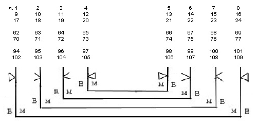
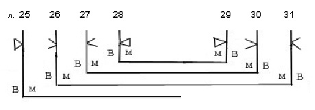
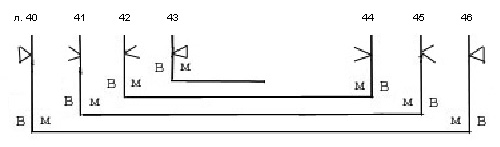
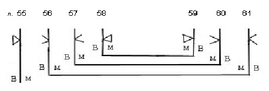
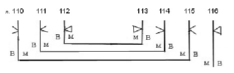
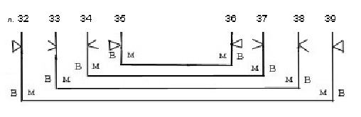
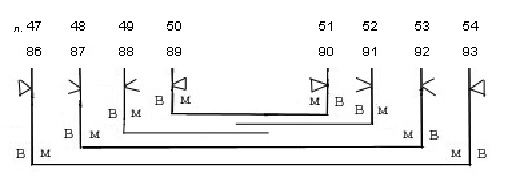
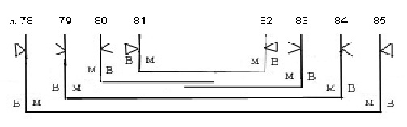
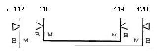

# Служебник № 526. XIV век

Древнерусский извод.

4° (210 / 213 x 147 / 156 мм). 120 л.

Между л. 31 и 32, 43 и 44, 61 и 62, 109 и 110 утрата листов.

Пергамен.

Устав.

Нумерация тетрадей не видна. Позднейшая нумерация листов арабскими цифрами чернилами в верхнем правом углу листов. Библиотечная нумерация карандашом на нижнем поле.

16 тетрадей: тетрадь 1 – 8 л. (л. 1 – 8), тетрадь 2 – 8 л. (л. 9 – 16), тетрадь 3 – 8 л. (л. 17 – 24), тетрадь 4 – 7 л. (л. 25 – 31; л. 25 вшивной), тетрадь 5 – 8 л. (л. 32 – 39), тетрадь 6 – 7 л. (л. 40 – 46, л. 43 вшивной), тетрадь 7 – 8 л. (л. 47 – 54, л. 49 и 52 вшивные), тетрадь 8 – 7 л. (л. 55 – 61, л. 55 вшивной), тетрадь 9 – 8 л. (л. 62 – 69), тетрадь 10 – 8 л. (л. 70 – 77), тетрадь 11 – 8 л. (л. 78 – 85; л. 80 и 83 вшивные), тетрадь 12 – 8 л. (л. 86 – 93, л. 88 и 91 вшивные), тетрадь 13 – 8 л. (л. 94 – 101), тетрадь 14 – 8 л. (л. 102 – 109), тетрадь 15 – 7 л. (л. 110 – 116, л. 116 вшивной), тетрадь 16 – 4 л. (л. 117 – 120, л. 117 и 120 вшивные).

Способ складывания пергаменных листов в тетрадях и система разлиновки в тетрадях 1, 2, 3, 9, 10, 13, 14:

Этот принцип сохраняется и в неполных тетрадях (поскольку неполнота тетради, как правило, в этом кодексе обусловлена утратой листа):

Тетрадь 4:

Тетрадь 6:

Тетрадь 8:

Тетрадь 15:

Другие варианты способа складывания листов и системы разлиновки:

Тетрадь 5:

Тетради 7, 12:

Тетрадь 11:

Тетрадь 16:

Тип разлиновки – Leroy 00А1.

Число строк: 17. Поле текста: 137 / 140 x 87 / 89 мм. Высота строки: 5 мм.

На л. 1 об. Заставка тератологического стиля: контуры киноварью, притенение по контуру желтой краской с мелким орнаментом светло-зеленой краской, фон голубой. В той же изысканной красочной палитре выполнены крупные тератологические инициалы – всего 114 инициалов (на л. 118 об. Контур инициала выполнен не киноварью, а светло-зеленой краской). Заголовки киноварные, некоторые заголовки контурными буквами (л. 5). В крупных заголовках первая строка контурными буквами – контур киноварью, заполнение желтой (л. 1 об., 69 об., 79, 87 об.) или синей (л. 55 об.) краской. При заголовке на л. 1 об. виньета-плетенка. Небольшие киноварные буквы в тексте, некоторые из них киноварные контурные, контурные с заполнением желтой краской.

Переплет – доски с тканевым покрытием (покрытие утрачено, судя по сохранившимся фрагментам заворотов на внутренней стороне нижней крышки переплета, это был бархат фиолетового цвета), Размер: 210 / 222 x 151 / 153 x 52 / 60 мм. Толщина крышек: 10 / 11 мм.

Крышки без кантов. Крепление переплета на трех ремнях, которые продеты в торец крышки, выведены на внутреннюю сторону, затем на внешнюю (в обоих случаях в специально сделанные в дереве углубления) и закреплены в толще доски. Форзацы пергаменные (форзац нижней крышки, являющийся последним листом последней тетради, отклеился). Сохранились два каптала, плетенные на корешке из суровых серых нитей, основа каптала – несколько полос кожи, свернутых в жгут. Доски обеих крышек имеют множество дыр, свидетельствующих об утраченных металлических защитно-декоративных элементах, а также о том, что переплет имел две застежки. Обрез блока выкрашен в красный цвет. На боковом обрезе на трех листах привязаны закладки из бордовых шелковых нитей.

Записи, наклейки, печати:

Записи рукой писца на полях у обреза листов мелкими буквами с текстом киноварных заголовков, читающихся на данных листах: на л. 60 на верхнем поле – «Въсклонься открыет дары» (перевернуто); на л. 119 об. на боковом поле – «А се дати въборзе причастье».

На л. 1: скорописью XVI – XVII вв. – «Антониева монастыря Римлянина»; скорописью крупно – «Служебник»; крупной скорописью другим почерком – «На одной просфоре и все три литургии имеющий»; скорописным почерком XIX в. – «Соф. Библиотеки № 526».

На л. 2 на верхнем поле скорописным почерком коричневыми чернилами – «XII века».

На л. 1 об., 10, 20 черными чернилами крупно – «Библиотеки Новгородскаго Софийскаго собора. 1855 года».

На л. 1, 1 об., 2, 120 печать-оттиск синего цвета овальной формы с надписью: «Из библиотеки СП\[етер\]бургской Духовной Академии».

На л. 120 об. библиотекарская заверочная запись 1948 г.

На внутренней стороне верхней крышки переплета наклейка с надписью – «№ 526. Соф.».

Состояние рукописи удовлетворительное. Брошюровка повреждена.

## Содержание

[Литургия Иоанна Златоуста](526_5.md) (без окончания) — л. 1 об. – л. 31 об.

Озаглавлена слуⷤ ст҃го иоана ꙁлатоустаго. Начинается с двух молитв священника перед литургией. Далее следует краткое описание проскомидии. На ектениях прошения об архиепископе, о князе (в анафоре об епископе). Перед молитвой «Никтоже достоин» приведена молитва «*Владыко животворяй, благым дателю*...», встречающаяся в некоторых итало-греческих евхологиях XI вв. как молитва Херувимской песни (Jacob 1970, 125). После Символа веры положена молитва «*Господи Иисусе Христе, любимый творче*...», неизвестная в греческих источниках. Причащение и окончание службы сходно с Соф. 520.

[Литургия Василия Великого](526_4.md) (без начала) — л. 32 – л. 55.

Представляет собой неполное чинопоследование, начинающееся с древней молитвы предложения «*Господи Боже наш, предложивыйся сам...*», молитвы антифонов и входа отсутствуют. В качестве молитвы Трисвятого использована молитва, которая употребляется в литургии Иоанна Златоуста в южноитальянских греческих евхологиях VIII–XII вв. (Jacob, 1970, 118–121). После Символа веры предписывается читать молитву «*Господи Иисусе Христе, любви творче*...», неизвестную в греческих источниках. В качестве заамвонной положена молитва «*Владыко Господи Иисусе, Христе Спасе наш, сподобивый ны Своея славы...*», имеющаяся в некоторых греческих евхологиях с XI в., (см. Орлов М. 1909, с. 306).

[Литургия преждеосвященных Даров](526_6.md) (без окончания) — л. 55 об. – л. 61 об.

Текст чинопоследования приведен почти полностью, обрывается он на заамвонной молитве. Последование относится к древнерусской редакции славянской литургии преждеосвященных Даров (Слуцкий 1996, 121; Афанасьева 2004б, 26), представленной 16‑ю списками. Озаглавлено, как и все списки этой редакции с҃лу. ст҃го пⷭ҇о. Как и в большинстве списков древнерусской редакции, а также в древнейших уставах (как студийского типа, так и кафедральных), первым днем служения литургии преждеосвященных Даров названа среда сыропустной недели. В соответствии с большинством списков древнерусской редакции (12-ти из 16-ти) в последовании отсутствует ектения и молитва о готовящихся к просвещению. При соединении Святых Даров произносится «*Смешение святого Тела и Крове Христа Бога*».

[Вечерня](526_1.md) (без начала) — л. 62 – л. 69 об.

Начинается с первой светильничной молитвы (без начала). Содержит восемь светильничных молитв, семь соответствуют современному служебнику, между четвертой и пятой имеется молитва «*Благословен еси, Господи Вседержителю, сведый ум человец, ведый, ихже требуем*...» (об этой молитве см. описание вечерни в [Соф. 522](../522/522_0.md#DDE_LINK1)). Заканчивается дополнительными тремя молитвами

«*Наслажьшеся, Господи, видением дни в твари вещьства Твоего...*»,

*«Тебе присносущаго и невечерняго света, Боже наш...*»

и «*Неусыпающее и непрестающее славословие...*»

первая из них озаглавлена *молитва егда поют канон.*

[Утреня](526_3.md) — л. 69 об. – л. 77.

Озаглавлена мⷧо ꙁаⷮᲂу. Приведены 11 утренних молитв (отсутствует 9‑я), причем 10‑я после 11-ой. После 10-ой молитвы приводится заключительная ектения и молитва главопреклонения «*Господи Боже святый, живый в вышних...*».

Молитва заамвонная на Рождество — л. 77 – л. 77 об.

Опубликована по данному списку в книге М. Орлов 1909 с. 372, 374. Выявлено 5 славянских служебников, содержщих эту молитву (Слуцкий 2005, с. 191, 192). Наиболее близок к данной рукописи текст молитвы из рукописи ГИМ Син.598.

Молитва заамвонная святую на Пасху — л. 77 об. – л. 79.

Опубликована в книге Орлов 1909, с. 344, 346 (по списку Соф. 524, но в аппарате указаны чтения Соф. 526) и в статье Слуцкий 2005 с. 192–194 (по служебнику Рум. 398 из РГБ, чтения Соф. 526 также приводятся в аппарате, наряду с другими 11‑ю списками).

[Чин великого водоосвящения на Богоявление](526_16.md) — л. 79 – л. 87 об.

Последование относится к редакции, распространенной в древнерусской рукописной традиции до реформ Киприана, но не соответствующей предписаниям Студийско-Алексеевского устава. Чтение Апостола и Евангелия не предусмотрены, указывается на чтение только трех паремий. Кроме обычных молитв последование содержит пролог и так называемую молитву патриарха Софрония. (Афанасьева 2004а, 26, 36)

[Чин крещения](526_17.md) (без окончания) — л. 87 об. – л. 109 об.

Озаглавлен крщ҃ние дѣтиное опубликован полностью в: Алмазов 1884, Приложение. С. 30–57. Заканчиватся молитвй *разрешити новокрещенаго в 8‑й день.* Содержит последование крещения и миропомазания. В конце – указание о несении новокрещенных младенцев до алтаря на Великом входе литургии.

Молитва без начала «...<em>в чистоте постное течение преити и скончати недвижиму веру...</em>» — л. 110 – л. 110.

Молитва «*Боже отец наших, вседержай аврамов исаков иаковль, створивый небо и землю и море и вся же в них...*» — л. 110 – л. 111.

Молитва «*Ты, Владыко Господи Боже Иисусе Христе, приими рабы Твоя ныне имярек и очисти я, яко же прият блудницу преведеную пред Тя фарисеем...*» — л. 111 – л. 112.

Молитва «*Владыко Господи человеколюбче, молим Ти ся о сих всех недостоиных рабех, к Тебе вопием...*» — л. 112 – л. 113.

Молитва *на Петров день детем* \[духовным\] «*Господи Иисусе Христе, Боже наш, Вседержителю, створивый от небытья в бытие все...*» — л. 113 – л. 114.

Молитва «*Господи Боже наш, заповедавый видением и гласом верховнему Своему апостолу Петру...*» — л. 114 – л. 114 об.

Молитва *на Рождество Христово детем* \[духовным\] «*Владыко Господи Вседержителю, рожийся от девы Марии в Вифлеоме июдеистем...*» — л. 115 – л. 116 об.

Молитва *на Пасху детем* «*Владыко Господи Боже наш, сподобивый ны преити время честнаго и божественного Твоего поста...*» — л. 116 об. – л. 118 об.

Молитва «*Владыко Господи Иисусе Христе, Боже наш, сподобивый ны святое се постное течение преити...*» — л. 118 об. – л. 119 об.

[Чин причащения больного на дому](526_12.md) — л. 119 об. – л. 120.

Озаглавлено а се дати въборꙁѣ причастⷷь.

[**Литература**](../literature.md)

Куприянов 1857, с. 104–107

Муретов 1895a, с. 221, 236, 240, 245, 254, 260, 261

Муретов 1895b, с. 69, 75, 76, 95, 97–99

Муретов 1897, с. 30, 40–41

Petrovskij 1908, p. 882–886

Орлов 1909, с. XXXIII (и далее)

Арранц 1979, с. 97, 125, 193

Розов 1979, с. 338

ПC № 1239

Слуцкий 1996, с. 120–124, 127, 130

Слуцкий 2000, 247, 248, 249

Рубан 2001, с. 18

Рубан 2002, с. 32

Слуцкий 2005, с. 185, 187, 189, 190, 192, 193, 194

Афанасьева 2004a, с. 26, 36

Афанасьева 2004b, с. 26 и далее

Афанасьева 2005а, с. 202

Афанасьева 2005b, с. 20, 21, 23, 24, 25, 28
